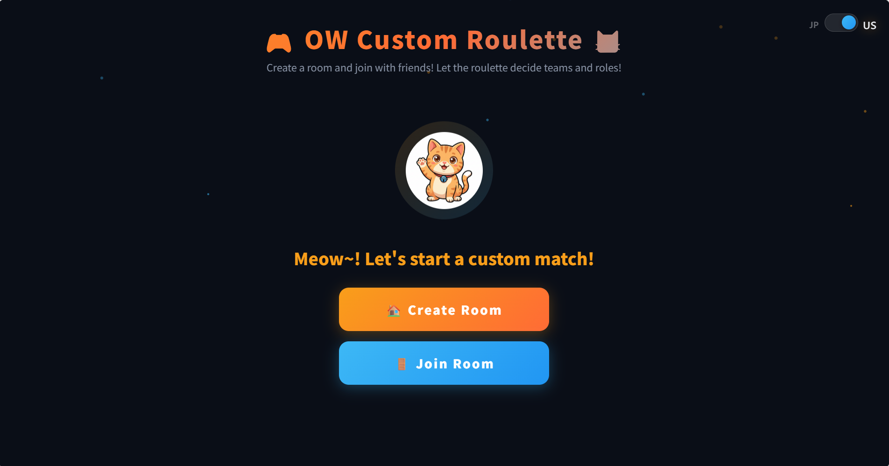
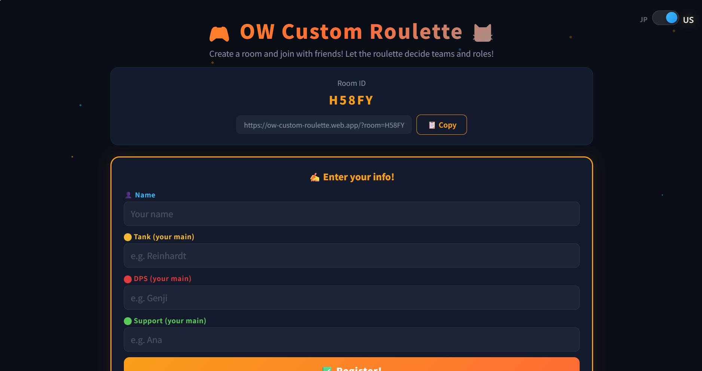

# 🎮 OW Custom Roulette 🐱

A web app that uses a roulette to decide teams and roles for Overwatch custom games (10 players)!

🌐 **App URL**: [https://ow-custom-roulette.web.app/](https://ow-custom-roulette.web.app/)
https://ow-custom-roulette.web.app/
---

## ✨ Features

- 🏠 **Room System** — Create a room and share the URL! Everyone can join from their phone or PC
- 🎰 **Roulette Animation** — Exciting slot machine-style presentation!
- 🐱 **Cat Announcer** — A cute cat character announces each player's role and hero one by one
- ⚔️ **Automatic 5vs5 Composition** — Auto-assigns with proper team comp: 1 Tank / 2 DPS / 2 Support
- 🎯 **Play Your Main** — Each player gets assigned their own most-played hero for that role

---

## 📖 How to Use

### 1️⃣ Create a Room
The host taps "🏠 Create Room"

### 2️⃣ Share the URL
Share the displayed URL with friends via messaging apps (📋 Copy button included)

### 3️⃣ Enter Your Heroes
Everyone opens the URL and enters their **name, main Tank, DPS, and Support heroes**, then taps "Register!"

### 4️⃣ Start the Roulette!
Once all 10 players have joined, the host taps "🎰 Start Roulette!"

### 5️⃣ Results!
The cat announces each player one by one → Team A vs Team B lineup is displayed!

---

## 🛠️ Tech Stack

| Technology | Purpose |
|------|------|
| HTML / CSS / JavaScript | Frontend |
| Firebase Realtime Database | Real-time data sync |
| Firebase Hosting | Web hosting |

---

## 📸 Screenshots

### Lobby Screen


### Menu Screen


---

## 🚀 Setup (For Developers)

```bash
# Clone
git clone https://github.com/imshota1009/ow-custom-roulette.git
cd ow-custom-roulette

# Install Firebase CLI
npm install -g firebase-tools

# Login to Firebase
firebase login

# Test locally
firebase serve

# Deploy
firebase deploy
```

---

## 📄 License

This project is licensed under the [MIT License](LICENSE).

## 🤝 Contributing

See [CONTRIBUTING.md](CONTRIBUTING.md) for how to contribute.

## 📚 Learn

See [LEARN.md](LEARN.md) for technical details about this project.
